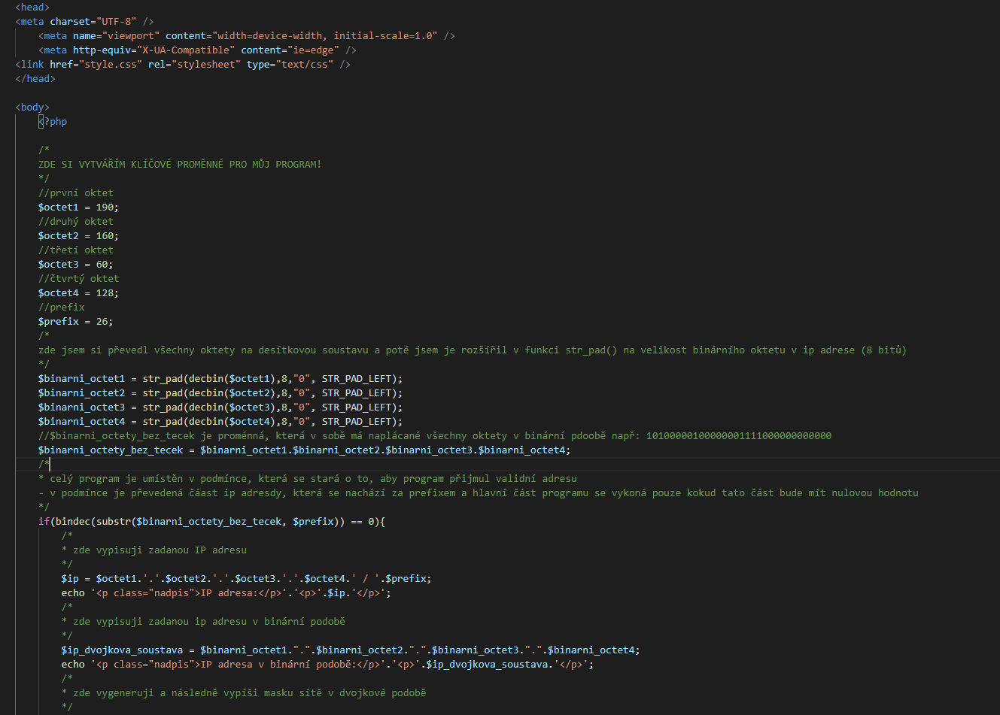
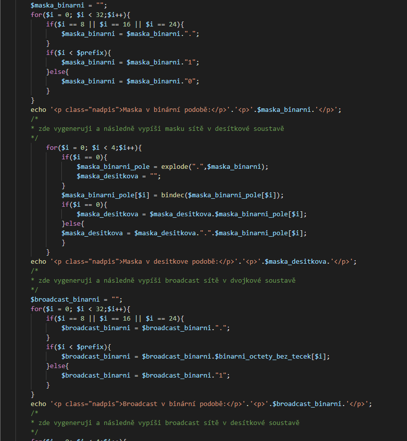
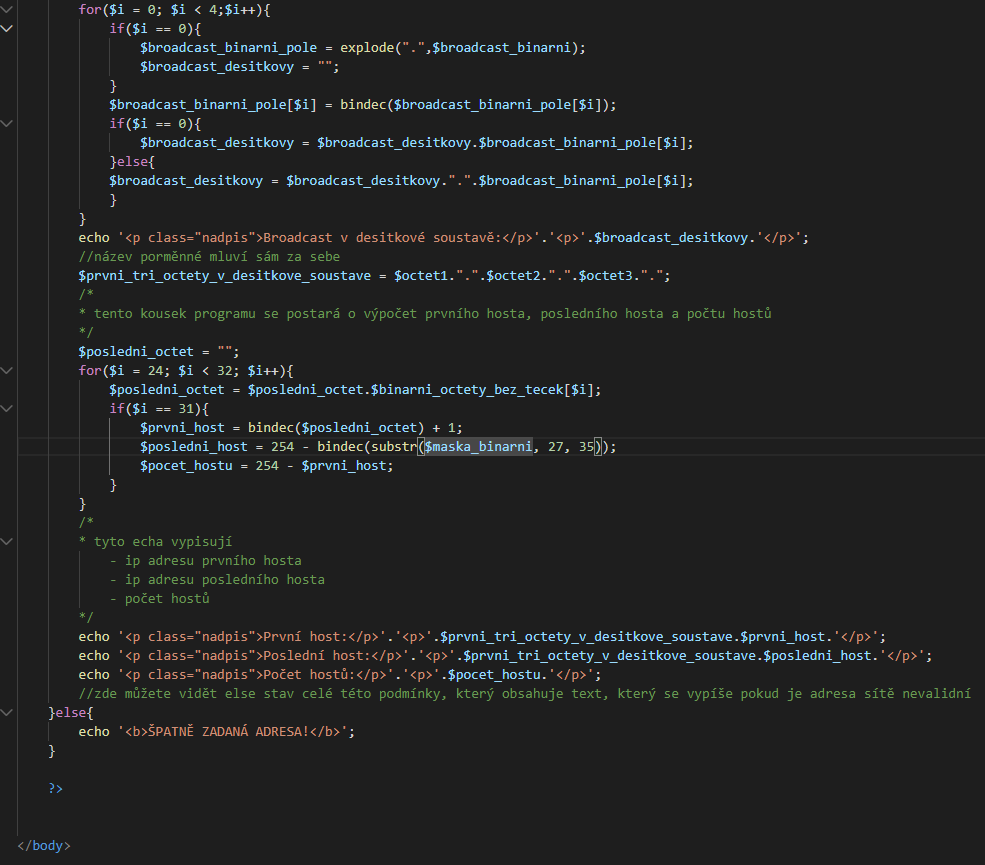
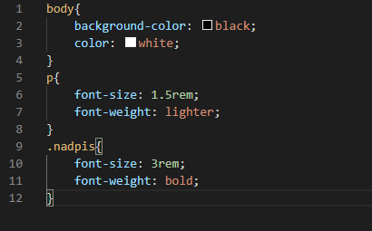
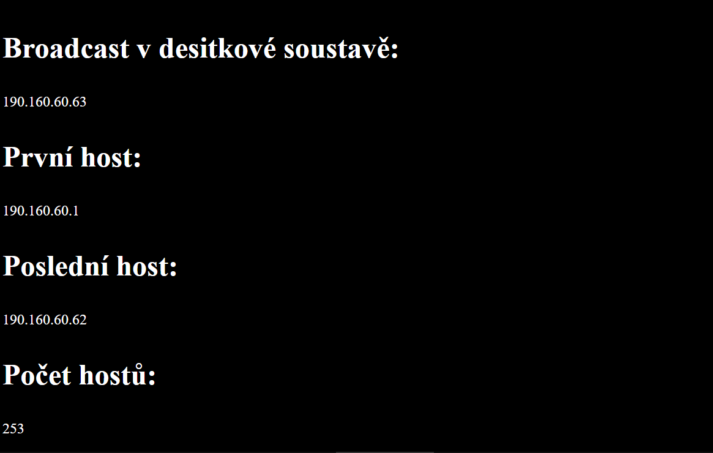

# ANALYZÁTOR IP ADRES
#### projekt v programovacím jazyce PHP
## můj program nemá žádné GUI, manipuluje se s ním v jeho zdrojovém kódu   zde jsou screenshoty mého programu:

### PHP zdrojový kód:

### CSS (nepodstatná část kódu)

### VÝSLEDEK KTERÝ VYPÍŠE VÝŠE UVEDENÝ PROGRAM:

